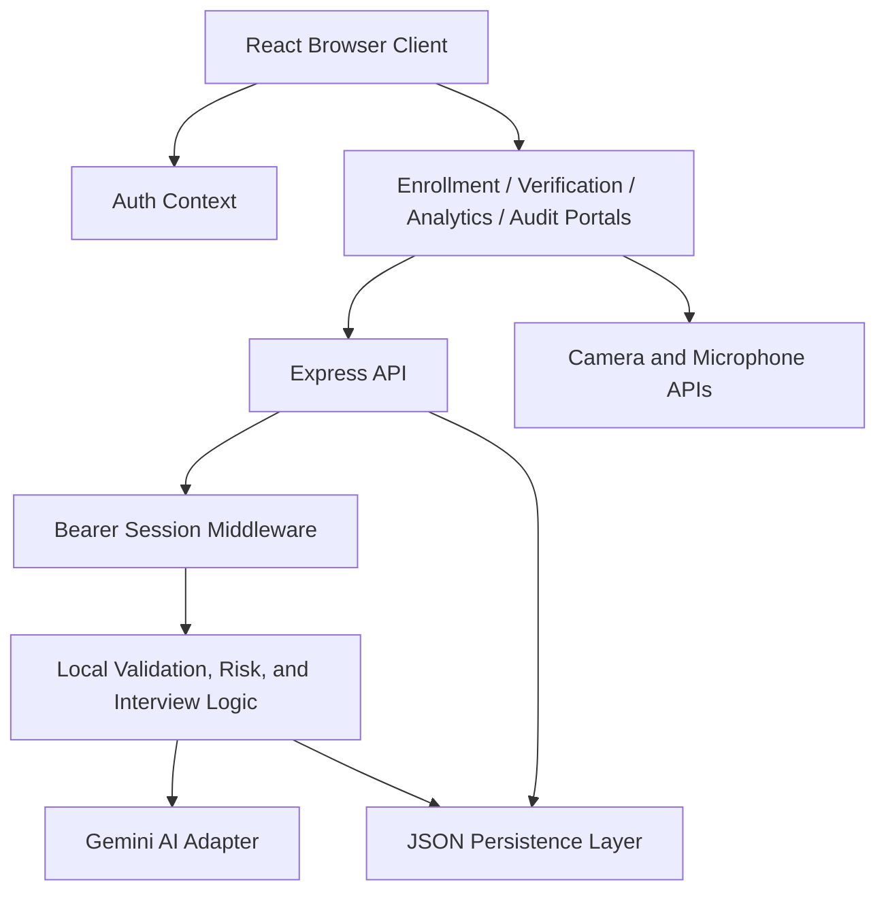

# Technical Report

## AI-Based Fake Identity and Document Screening System

**Repository:** `https://github.com/Flint884/SIH-188`  
**Application type:** Full-stack TypeScript web application  
**Runtime:** Node.js, Express, React, Vite  
**Primary use:** AI-assisted identity and document screening at a border checkpoint  
**Document status:** Implementation report for the current repository

---

## 1. Executive Summary

The AI-Based Fake Identity and Document Screening System is a browser-based checkpoint application that combines document processing, identity registry lookup, OCR, document validation, tampering analysis, face verification, liveness checks, adaptive immigration interviewing, risk assessment, audit logging, and officer-led final decisions.

The platform is intentionally designed as an assistive screening system. Automated modules produce evidence and recommendations, while the authorized officer retains control of the final operational decision.

The current Verification Portal workflow is:

```text
Document and OCR
    -> Registry Lookup and Parity Comparison
    -> Forensic Tampering Analysis
    -> Face Biometrics and Liveness
    -> Optional AI Immigration Interview
    -> Existing Risk Assessment and Final Verdict
```

---

## 2. Objectives

The system is designed to help checkpoint officers:

1. Capture identity and travel documents digitally.
2. Extract document fields through OCR.
3. Compare scanned information with enrolled records.
4. Detect possible physical or digital document manipulation.
5. Compare a live traveler face against a stored or document portrait.
6. Check live human presence and presentation-attack indicators.
7. Ask adaptive immigration pre-screening questions.
8. Combine verification outputs into an explainable risk assessment.
9. Preserve an auditable history of actions and decisions.
10. Support manual review instead of relying on automatic rejection.

---

## 3. Scope

### Included

- Officer authentication and session management.
- Role-based portal access.
- Identity enrollment.
- Document upload and camera capture.
- OCR extraction and correction.
- Document and identity validation.
- Registry lookup and comparison.
- Tampering and forgery analysis.
- Face capture and biometric comparison.
- Liveness and presentation-attack checks.
- Adaptive AI immigration interview.
- Risk calculation and final decision presentation.
- Analytics, alerts, reports, and audit trails.
- Local persistent development database.

### Not included

- Production government database integrations.
- Certified biometric or forensic hardware.
- Legal immigration decisions.
- Watchlist, criminal-record, or sanctions integrations.
- Blockchain or distributed identity storage.
- A production-grade multi-user database cluster.
- A guarantee that AI output is factually or legally authoritative.

---

## 4. Technology Stack

| Layer | Technology | Purpose |
| --- | --- | --- |
| Frontend | React 19 | Component-based user interface |
| Language | TypeScript | Static typing across frontend and backend |
| Frontend build | Vite 6 | Development server and production frontend build |
| Backend | Express 4 | HTTP API, authentication middleware, and static serving |
| AI integration | `@google/genai` | Gemini OCR, analysis, and interview reasoning |
| Styling | Tailwind CSS 4 and custom CSS | Dark checkpoint terminal interface |
| Icons | Lucide React | Consistent interface iconography |
| Motion | Motion | Controlled workflow and modal transitions |
| Runtime tooling | `tsx` | Run TypeScript server directly during development |
| Production bundling | esbuild | Bundle the Express server |
| Persistence | JSON file database | Local development and demonstration persistence |
| Password security | Node.js `crypto.scrypt` | Password hashing and verification |

---

## 5. Repository Structure

```text
.
├── data/
│   ├── checkpoint_db.json
│   └── checkpoint_db.seed.json
├── public/
│   └── assets/
├── server.ts
├── server/
│   ├── ai.ts
│   ├── auth.ts
│   ├── db.ts
│   └── interview.ts
├── src/
│   ├── App.tsx
│   ├── index.css
│   ├── main.tsx
│   ├── types.ts
│   ├── components/
│   ├── context/
│   └── utils/
├── index.html
├── metadata.json
├── package.json
├── package-lock.json
├── tsconfig.json
├── vite.config.ts
├── README.md
└── TECHNICAL_REPORT.md
```

### Important modules

- `src/App.tsx`: application shell, authentication provider, portal routing, and global layout.
- `src/context/AuthContext.tsx`: client-side authentication state and token handling.
- `src/components/LoginScreen.tsx`: officer login and local demo account presets.
- `src/components/EnrollmentPortal.tsx`: enrollment and identity-record creation workflow.
- `src/components/VerificationPortal.tsx`: sequential screening workflow and final decision presentation.
- `src/components/AdaptiveInterviewView.tsx`: text and microphone-based interview UI.
- `src/components/CameraCapture.tsx`: camera capture and capture-quality workflow.
- `src/components/ForensicCheckView.tsx`: tampering-analysis presentation.
- `server/ai.ts`: OCR, validation, tampering, face, risk, and decision logic.
- `server/interview.ts`: adaptive interview initialization, AI reasoning, fallback reasoning, and country normalization.
- `server/auth.ts`: password hashing, token sessions, and session expiration.
- `server/db.ts`: local database state, repository operations, persistence, and seed initialization.
- `src/types.ts`: shared domain contracts.

---

## 6. System Architecture



### Request flow

1. The browser loads the React application from the Express/Vite server.
2. An officer authenticates through `/api/auth/login`.
3. The server creates an in-memory bearer session.
4. The frontend stores the session token for the current browser session.
5. Protected requests send `Authorization: Bearer <token>`.
6. Express middleware validates the session and role.
7. The relevant service performs local processing or calls Gemini.
8. Results are persisted to the local JSON database when appropriate.
9. The frontend renders evidence and keeps the officer in control of the next action.

---

## 7. Authentication and Authorization

### Authentication

Passwords are hashed using Node.js `crypto.scryptSync` with a random 16-byte salt. Password verification uses `crypto.timingSafeEqual` to reduce timing leakage.

Successful login returns:

- A generated session token prefixed with `chkpt_`.
- User ID.
- Username.
- Full name.
- Role.
- Badge number.
- Checkpoint.
- Creation and last-login metadata.

### Sessions

- Sessions are stored in memory in the running server process.
- Session lifetime is 12 hours.
- Expired sessions are removed when accessed.
- Logout deletes the session token.
- Restarting the server clears all active sessions.

### Roles

| Role | Primary access |
| --- | --- |
| `ADMIN` | All portals and database administration |
| `DATA OFFICER` | Enrollment and identity data operations |
| `VERIFICATION OFFICER` | Verification, biometric checks, and final screening |
| `ANALYST` | Analytics and intelligence review |
| `VIEWER` | Read-only audit access |

Authorization is enforced in the API through the `requireAuth()` middleware and role allow-lists.

---

## 8. Functional Workflows

## 8.1 Login

1. Officer opens the application.
2. The login form submits username and password to `/api/auth/login`.
3. The server checks the account and password hash.
4. A session token is returned.
5. The frontend loads the portal appropriate for the officer role.

## 8.2 Enrollment Workflow

1. Officer selects a document type.
2. Officer uploads a file or captures a document image.
3. The image is optimized before large requests are sent.
4. OCR extracts names, dates, nationality, document numbers, MRZ data, and visa fields.
5. The officer may correct OCR data with a required correction reason.
6. The server validates the document fields and identity consistency.
7. The officer captures a face reference.
8. The identity profile, document, OCR result, validation result, and face record are persisted.
9. Audit events record creation and correction actions.

## 8.3 Verification Workflow

### Stage 1: Document and OCR

- Upload or capture the credential.
- Run `/api/ocr/process`.
- Run `/api/validate/document`.
- Keep the OCR result in frontend state.

### Stage 2: Registry Lookup and Comparison

- Search the local registry with passport number, document number, or name.
- Load matching identity, stored document, stored OCR, and stored face data.
- Render field-by-field comparison.
- Continue even when no identity is found; missing registry data is treated as a review condition rather than an application failure.

### Stage 3: Tampering Analysis

- Send the document image to `/api/verification/tampering-analysis`.
- Analyze photo integrity, text consistency, layout, compression, copy-paste indicators, MRZ consistency, and metadata.
- Show forensic regions and risk classification.

### Stage 4: Face Biometrics

- Capture a live camera image.
- Compare the live image with a stored face or document portrait.
- Evaluate facial similarity and liveness.
- Detect possible printed-photo, screen-replay, deepfake, or mask/object attacks.

### Stage 5: AI Immigration Interview

- Start an interview using existing OCR and registry context.
- Ask adaptive questions about purpose, destination, duration, accommodation, and travel plans.
- Accept microphone speech recognition or typed responses.
- Continue for up to five focused questions.
- Normalize equivalent country names, including `India`, `Republic of India`, `Bharat`, and `IND`.
- Use local deterministic reasoning if Gemini is unavailable.
- Keep unresolved discrepancies visible for officer review.

### Stage 6: Existing Risk and Final Decision

- Calculate the existing screening risk from validation, registry lookup, tampering, face, liveness, and interview results.
- Classify the assessment as `LOW`, `REVIEW`, or `HIGH`.
- Determine the final result as:
  - `VERIFIED`
  - `REVIEW_REQUIRED`
  - `ANOMALY_DETECTED`
- Persist the completed verification session.
- Present officer actions for completion, review, recapture, recheck, or manual review.

---

## 9. AI Processing

### Gemini model fallback

The AI adapter tries a small model cascade instead of depending on one model name:

1. `gemini-3.1-flash-lite`
2. `gemini-3.8-flash`
3. `gemini-flash-latest`

Each request has a timeout. If a model fails, the next candidate is attempted.

### OCR

The OCR pipeline sends an optimized document image and requested document type to the AI adapter. The result is normalized into the shared `OcrResult` contract. Dates are converted to ISO format where possible.

### Validation

Validation is based on deterministic checks over OCR and profile data, including:

- Required fields.
- Date formatting.
- Expiry status.
- Document number format.
- Name consistency.
- Date-of-birth consistency.
- Nationality consistency.
- MRZ consistency.
- Image quality.
- Duplicate identity conditions.

### Tampering analysis

The tampering module produces:

- Overall status: `PASS`, `WARNING`, or `FAIL`.
- Tampering risk: `LOW`, `MEDIUM`, or `HIGH`.
- Factor descriptions.
- Optional flagged regions.
- Summary text.
- Timestamp.

### Face verification

The face module returns:

- Match result.
- Match score.
- Factor breakdown.
- Explanation.
- Liveness result.
- Human-face detection.
- Image quality information.

The application consumes this result; it does not implement a separate frontend face-recognition algorithm.

### Adaptive interview

The interview uses structured JSON output when Gemini is available. The prompt includes the current case context, previous questions, previous answers, current extracted state, and strict rules for professional, non-accusatory questioning.

If Gemini is unavailable, local reasoning identifies common travel signals such as tourism, work, conferences, education, duration, destination cities, and accommodation.

---

## 10. Risk and Decision Logic

The risk engine adds weighted impacts from existing verification evidence:

| Evidence source | Examples of impact |
| --- | --- |
| Document validation | Failed or warning checks |
| Registry match | Missing stored identity |
| Tampering | Medium or high anomaly |
| Face comparison | Mismatch or inconclusive result |
| Liveness | Spoof or uncertain human presence |
| Interview | Unresolved inconsistency or clarification |

The score is normalized to `0-100`:

- `0-29`: `LOW`
- `30-69`: `REVIEW`
- `70-100`: `HIGH`

Critical conditions such as failed validation, face mismatch, spoof detection, no human face, high tampering, or high risk produce `ANOMALY_DETECTED`.

Warnings, inconclusive biometric output, medium tampering, medium risk, or interview review produce `REVIEW_REQUIRED`.

The risk engine is assistive. It does not itself establish legal guilt or replace the authorized officer.

---

## 11. Data Model

The local database uses the following collections:

- `users`
- `identity_profiles`
- `documents`
- `ocr_results`
- `document_validation_results`
- `face_records`
- `verification_sessions`
- `face_verification_results`
- `tampering_analysis`
- `risk_assessments`
- `alerts`
- `audit_logs`

### Main relationships

```text
IdentityProfile
  └── Documents
        └── OCR Results
  └── Face Records

VerificationSession
  ├── Scanned OCR
  ├── Matched Identity
  ├── Stored Document
  ├── Stored Face
  ├── Validation Result
  ├── Tampering Analysis
  ├── Face Verification
  ├── Interview State
  └── Risk Assessment
```

### Persistence behavior

- Database state is loaded from `data/checkpoint_db.json` at server startup.
- Writes are persisted through a temporary file and atomic rename.
- If the file cannot be loaded, the application initializes an in-memory fallback.
- Seed initialization creates officer accounts and empty operational collections.

---

## 12. API Reference

### Health and authentication

| Method | Endpoint | Purpose |
| --- | --- | --- |
| `GET` | `/api/health` | Server health check |
| `POST` | `/api/auth/login` | Authenticate an officer |
| `POST` | `/api/auth/logout` | Destroy current session |
| `GET` | `/api/auth/me` | Load current user |

### Dashboard and analytics

| Method | Endpoint | Purpose |
| --- | --- | --- |
| `GET` | `/api/dashboard/stats` | Dashboard metrics |
| `GET` | `/api/analytics` | Analytics data |

### OCR and validation

| Method | Endpoint | Purpose |
| --- | --- | --- |
| `POST` | `/api/ocr/process` | Extract document data |
| `POST` | `/api/ocr/correct` | Save authorized OCR correction |
| `POST` | `/api/validate/document` | Validate OCR and profile data |

### Identity records

| Method | Endpoint | Purpose |
| --- | --- | --- |
| `POST` | `/api/identities` | Create an identity record |
| `GET` | `/api/identities` | List identities |
| `GET` | `/api/identities/:id` | Load an identity and related records |
| `PUT` | `/api/identities/:id` | Update an identity |

### Verification

| Method | Endpoint | Purpose |
| --- | --- | --- |
| `POST` | `/api/verification/lookup` | Search the registry |
| `POST` | `/api/verification/tampering-analysis` | Analyze document integrity |
| `POST` | `/api/verification/face-verify` | Compare faces and liveness |
| `POST` | `/api/verification/interview/start` | Start adaptive interview |
| `POST` | `/api/verification/interview/answer` | Process an interview answer |
| `POST` | `/api/verification/calculate-risk` | Calculate existing risk assessment |
| `POST` | `/api/verification/complete` | Persist completed screening |
| `GET` | `/api/verification/sessions` | List verification sessions |
| `GET` | `/api/verification/sessions/:id` | Load a verification session |

### Alerts and administration

| Method | Endpoint | Purpose |
| --- | --- | --- |
| `GET` | `/api/alerts` | List alerts |
| `POST` | `/api/alerts/:id/resolve` | Resolve an alert |
| `GET` | `/api/database/stats` | Database statistics |
| `DELETE` | `/api/database/identities/:id` | Delete an identity |
| `DELETE` | `/api/database/documents/:id` | Delete a document |
| `DELETE` | `/api/database/sessions/:id` | Delete a session |
| `POST` | `/api/database/reset` | Reset database data |
| `POST` | `/api/database/clear-table` | Clear one data table |
| `POST` | `/api/admin/purge-all-data` | Purge operational data |

All routes except `/api/health` and login require a valid bearer token. Destructive and sensitive operations additionally require role authorization.

---

## 13. Frontend Design and Accessibility

The interface uses a dark blue checkpoint-operations theme with:

- Consistent navigation and portal headers.
- Status colors for verified, review, warning, and anomaly states.
- Responsive layouts for desktop and smaller screens.
- Camera and microphone permission feedback.
- Loading, empty, error, and completion states.
- Clear officer actions for retry, recheck, review, and completion.
- Text labels alongside icons for operational controls.

Browser permissions required:

- Camera permission for document and face capture.
- Microphone permission for interview speech recognition.
- HTTPS or localhost is recommended for browser media APIs.

---

## 14. Error Handling and Resilience

The application handles common failures through:

- Protected API routes and invalid-session responses.
- AI model fallback attempts.
- AI request timeouts.
- Deterministic interview fallback logic.
- OCR JSON parsing protection.
- Large JSON body limits for image payloads.
- Local database initialization fallback.
- Missing registry records without crashing the verification flow.
- Camera and microphone permission messages.
- Explicit loading and error states in the frontend.

A missing Gemini key does not prevent the server from starting. AI-dependent functions may fall back or return a configuration-related result.

---

## 15. Security and Privacy Assessment

### Current protections

- Environment files are ignored by Git.
- Passwords use salted scrypt hashes.
- Session tokens are random and expire.
- API endpoints use bearer authentication.
- Role-based authorization protects sensitive actions.
- Password fields and secret fields are not returned in user API responses.
- Database writes use an atomic temporary-file replacement strategy.
- Audit events record important operational actions.
- The UI warns that automated results require officer review.

### Production improvements required

Before real deployment, add:

1. HTTPS termination and secure transport everywhere.
2. Secure, HttpOnly, SameSite session cookies or a hardened token strategy.
3. Persistent server-side sessions or a distributed session store.
4. A production database with transactions and backup policies.
5. Secret storage through a managed vault rather than local environment files.
6. Rate limiting, account lockout, and login anomaly monitoring.
7. Stronger input validation and structured request schemas.
8. Image malware scanning and file-type validation.
9. Data retention and deletion policies for biometric and passport data.
10. Encryption at rest and in transit.
11. Access logging, alerting, and security monitoring.
12. Formal biometric, accessibility, privacy, and legal review.
13. Independent testing against spoofing and adversarial documents.

This repository is an academic/demo implementation and must not be treated as a certified identity or immigration decision system.

---

## 16. Installation and Operation

### Prerequisites

- Node.js 20 or newer recommended.
- npm.
- Gemini API key for live AI operations.
- Browser camera and microphone permissions for media workflows.

### Installation

```bash
git clone https://github.com/Flint884/SIH-188.git
cd SIH-188
npm install
```

Create `.env.local`:

```env
GEMINI_API_KEY=your_gemini_api_key_here
```

Start development mode:

```bash
npm run dev
```

Open:

```text
http://localhost:3000
```

### Production-style local run

```bash
npm run build
npm start
```

### Health check

```text
GET http://localhost:3000/api/health
```

Expected response shape:

```json
{
  "status": "ok",
  "timestamp": "2026-09-07T..."
}
```

---

## 17. Demo Accounts

These accounts are seeded for local demonstration only:

| Role | Username | Password |
| --- | --- | --- |
| Admin | `admin` | `Admin@Pass123` |
| Data Officer | `officer_data` | `Enroll@Pass123` |
| Verification Officer | `officer_verify` | `Verify@Pass123` |
| Analyst | `analyst_user` | `Analyze@Pass123` |
| Viewer | `viewer_guest` | `View@Pass123` |

Replace or remove these credentials before production use.

---

## 18. Verification and Test Evidence

The repository has been validated with the following commands during implementation:

```bash
npm run lint
npm run build
```

The checks verify:

- TypeScript compilation without emitted files.
- React and server bundle compilation.
- Express production server bundling.
- CSS and frontend module transformation.
- No TypeScript diagnostics in the changed workflows.

Manual browser checks performed during development included:

- Login and seeded role selection.
- Server health response.
- Admin and verification portal rendering.
- Dark theme rendering without unintended white surfaces.
- Verification workflow stage rendering.
- Microphone and speech-recognition API availability.
- Interview context rendering and country-name normalization.

Recommended test matrix for future changes:

| Area | Test |
| --- | --- |
| Authentication | Valid login, invalid login, expired session, logout |
| Roles | Admin, data officer, verification officer, analyst, viewer |
| OCR | Valid image, large image, malformed response, AI unavailable |
| Validation | Pass, warning, fail, missing fields |
| Registry | Match, no match, partial name, missing document |
| Tampering | Low, medium, high, timeout |
| Biometrics | Match, mismatch, inconclusive, spoof, no face |
| Interview | Typed response, microphone response, denied permission, AI fallback |
| Persistence | Create, update, delete, reset, malformed database file |
| UI | Desktop, mobile, loading, empty, error, and final states |

---

## 19. Known Limitations

- The JSON database is not suitable for concurrent production traffic.
- Active sessions are lost when the server restarts.
- The current system relies on browser camera and microphone support.
- AI responses depend on external model availability and prompt behavior.
- Local fallback reasoning is intentionally limited and rule-based.
- OCR and face results require officer validation.
- No formal accuracy benchmark is included in the repository.
- No production CI pipeline or automated end-to-end test suite is currently configured.
- Demo credentials are present for local usability and must be replaced for deployment.
- Biometric and passport data require stricter production retention and encryption controls.

---

## 20. Conclusion

The system provides a complete demonstrable workflow for AI-assisted identity and document screening. Its architecture separates frontend portals, protected Express routes, AI adapters, deterministic verification logic, authentication, and persistence. The design keeps automated analysis explainable and places the authorized officer at the final decision point.

For production readiness, the next engineering priorities are a durable database, hardened session security, secret management, privacy controls, automated testing, performance testing, model evaluation, and formal legal/compliance review.
